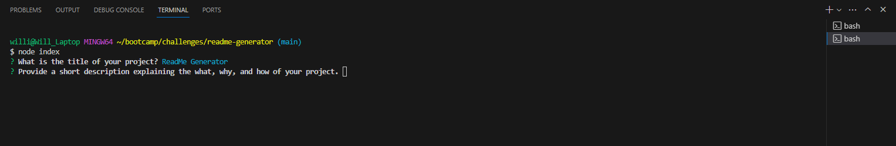

# ReadMe Generator 

  ## Description

  As a developer, I want a README generator so that I can quickly create a professional README for a new project.This project utilizes JavaScript, Node.js, and inquirer to create the professional ReadMe.
              
  ## Table of Contents
  - [Installation](#installation)
  - [Usage](#usage)
  - [Credits](#credits)
  - [License](#license)
  - [Questions](#questions)
 
          
  ## Installation
  Installing Inquirer is necessary for running this application.
          
  ## Usage

  Enter 'node index' into the  terminal and push enter
  

  You will be asked a series of questions in the terminal. Answer each question and only press enter when your response in complete.
  
  
  When the questions are complete a README will be generated
          
  ## Credits
  Starter code was provided by https://github.com/coding-boot-camp/potential-enigma.

  Tutoring session with Jose Lopez
  
  ## License
  
  This repo is covered under MIT license, see the LICENSE in the repo

  ## Questions
  
  Check out my repos here: [Github](https://github.com/wmr89)

  you can email me at the following: [william.rankin01@gmail.com](mailto:william.rankin01@gmail.com)
  
  
